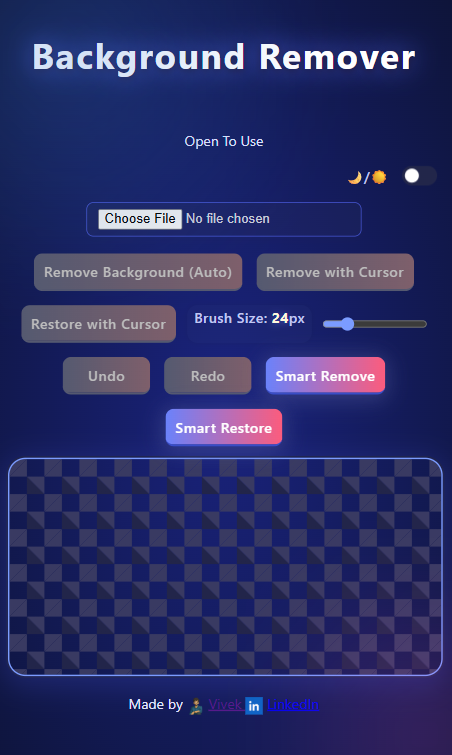

# Background Remover

Effortlessly remove backgrounds from your images with our free, AI-powered Background Remover tool! Upload any photo and get a transparent PNG in seconds. Whether you need automatic background removal, smart selection, or manual brush editing, our tool makes it easy for everyone. No sign-up required, no watermarks — just fast, reliable results.

[Live Demo](https://yourdomain.com/) <!-- Update with your actual live URL -->

---

## Features

- **One-click automatic background removal with AI**
- Manual brush and smart magic wand tools for precision editing
- Real-time preview and undo/redo functionality
- Download your image as a high-quality PNG with a transparent background
- Dark and light theme support
- 100% free and privacy-friendly — your images never leave your device

---

## How to Use

1. **Upload your image** by clicking the file input button.
2. Click **“Remove Background (Auto)”** or use the **Smart Remove/Restore** or **manual brush tools** for detailed editing.
3. Adjust the **brush size** and use **Undo/Redo** as needed.
4. Click **Download** to save your new image with a transparent background.

---

## Installation

1. **Clone the repository:**
   ```bash
   git clone https://github.com/yourusername/background-remover.git
   cd background-remover
   ```

2. **Open `index.html` in your browser**  
   No build steps required!

---

## Screenshot



---

## Contributing

Contributions, issues and feature requests are welcome!  
Feel free to [open an issue](https://github.com/yourusername/background-remover/issues) or submit a pull request.

---

## License

This project is licensed under the [MIT License](LICENSE).

---

## Author

Made by [Vivek Prajapati](https://vivek2034.github.io/Portfolio-vivek-/)  
[LinkedIn](https://www.linkedin.com/in/vivek-prajapati-699308251/?utm_source=share&utm_campaign=share_via&utm_content=profile&utm_medium=android_app)
